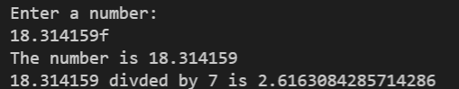

# 1-5 Exercise 2

### The assignment
Edit the file named "student.py".  
Create a program that takes in a float number with the letter f at the end (this is used in some languages like Java). The length may change but the last character will always be the letter f. Remove the letter f and typecast it to a float variable like this:  

## Check your work
Select the "Actions" tab on GitHub and select your latest commit. This will show you if your exercise passes all test cases.
